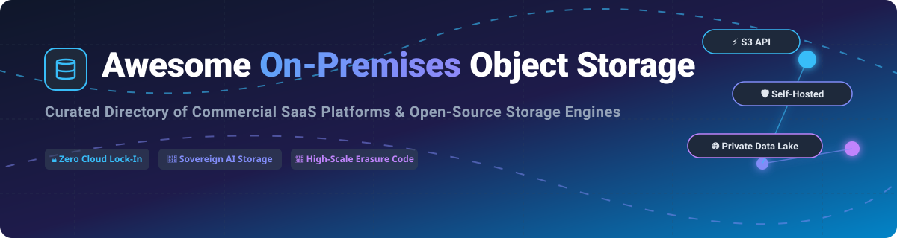

  

  
  
  
  
  
  

---

# 📦 Awesome On-Premises Object Storage 🚀

> **💡 Curated Ecosystem Guide for On-Premises Object Storage, S3-Compatible Self-Hosted Storage, Enterprise Data Lakes & Private Cloud Infrastructure.**

A comprehensive, SEO-optimized guide and directory of **enterprise SaaS / commercial object storage platforms** 🏢 and **open-source storage engines** 🛠️ enabling S3-compatible object storage on-premises. Designed for storage architects 🏗️, DevOps engineers ⚡, and infrastructure leads 🛡️ building sovereign AI data pipelines 🤖, private data lakehouses 📊, and ransomware-resilient backup repositories 🔐 without public cloud lock-in.

---

## 📌 Keywords & Topics
`on-premises object storage` 💾 • `s3-compatible` ⚡ • `self-hosted storage` 🏠 • `private cloud data lake` 🌊 • `software-defined storage` 💻 • `distributed object storage` 🌐 • `minio` 🚀 • `ceph` 🐙 • `enterprise object storage` 🏢 • `ai data pipeline storage` 🤖

---

## 📋 Table of Contents
- [📈 Sector Market Size & Structure](#-sector-market-size--structure)
- [🏢 Enterprise & Commercial SaaS Platforms](#-enterprise--commercial-saas-platforms)
- [🛠️ Open-Source GitHub Projects](#%EF%B8%8F-open-source-github-projects)
- [🏗️ Architecture Decision Matrix](#%EF%B8%8F-architecture-decision-matrix)
- [💖 Support & Sponsorship](#-support--sponsorship)
- [🤝 How to Contribute](#-how-to-contribute)
- [⚖️ Disclaimer & License Notes](#%EF%B8%8F-disclaimer--license-notes)
- [⭐ Star History](#-star-history)

---

## 📈 Sector Market Size & Structure

> 💡 **Market Sizing & Dynamics:** The global object storage market is estimated at **$37.10 Billion in 2025** and is projected to expand at a **15.8% CAGR** to over **$138 Billion by 2034** 🚀. While public cloud hyperscalers dominate public cloud storage ☁️, the **on-premises software-defined object storage sector is moderately fragmented** 🧩 — comprising established enterprise storage appliance giants (Dell, NetApp, IBM, Pure Storage, Hitachi) and specialized software-defined S3 platforms (MinIO, Scality, Cloudian), creating a competitive, non-winner-take-all landscape driven by sovereign AI workloads 🤖, data residency compliance 🔒, and egress cost reduction 💰.

---

## 🏢 Enterprise & Commercial SaaS Platforms

Below is the curated list of leading commercial and enterprise on-premises S3-compatible object storage platforms, **sorted in descending order by parent company valuation / annual revenue**:

| Rank 🏆 | Product / Platform 📦 | Company & Size / Valuation 📊 | Starting Pricing 💰 | Free Tier / Trial Limit 🎁 | Key Focus & Best For 🎯 |
| :---: | :--- | :--- | :--- | :--- | :--- |
| 1 👑 | **[Amazon S3 Outposts](https://aws.amazon.com/s3/outposts/)** | **Amazon.com, Inc.** • Market Cap: **~$2.70 Trillion** 💎 • Revenue: **$638B/yr** ($42.2B/qtr AWS) | **~$0.10 / GB / month** provisioned storage + Outposts hardware rack commit (1U server starts ~$500/mo on 3-yr term) | **No Free Trial for Hardware** ⏳ *(AWS regional free tier 5GB does not apply to Outposts physical hardware)* | Native AWS hybrid infrastructure with local data residency & AWS S3 API compatibility 🌐. |
| 2 🥈 | **[Dell EMC ECS](https://www.dell.com/)** | **Dell Technologies Inc.** • Market Cap: **~$360 Billion** 🏢 • Revenue: **$95.0 Billion** | Starts at **~$0.015–$0.03 / GB / month** amortized software capacity (starter array hardware packages from ~$45,000 upfront) | **Unlimited Non-Production Free Evaluation** ♾️ via Dell ECS Community Edition *(virtual appliance without enterprise encryption)* | Enterprise compliance, WORM, ObjectLock, and multi-tenant petabyte-scale storage 🛡️. |
| 3 🥉 | **[IBM Cloud Object Storage](https://www.ibm.com/)** | **IBM Corporation** • Market Cap: **~$205 Billion** 🔷 • Revenue: **$67.5 Billion** | **$0.012 / GB / month** (Standard Plan) or **$12.00 / TB / month** (One-Rate Plan); starter node hardware from ~$35,000 | **Free Forever Plan: 5 GB / month** 🎁 storage + 20k Class A / 100k Class B requests + **$200 USD account credit** (valid 30 days) | Geo-dispersed erasure coding (SecureSlice) with exabyte-scale durability 🌍. |
| 4 🏅 | **[Hitachi Content Platform](https://www.hitachivantara.com/)** | **Hitachi, Ltd. / Hitachi Vantara** • Market Cap: **~$158 Billion** ⚙️ • Revenue: **$65.0 Billion** | Starts at **~$0.02–$0.04 / GB / month** amortized subscription (entry software-defined node starter licenses from ~$30,000/yr) | **30-Day Free Trial** ⏳ for VSP One Software-Defined Storage + sandbox access via Hitachi Vantara Demo Center | Hybrid cloud tiering, advanced metadata indexing, IoT, and medical/surveillance data 🔬. |
| 5 🏅 | **[Pure Storage FlashBlade](https://www.purestorage.com/)** | **Pure Storage, Inc.** • Market Cap: **~$46.5 Billion** ⚡ • Revenue: **$3.64 Billion** | Under **$0.20 / GB** ($200/TB) inclusive of 3 years service on FlashBlade//E (scaling starting at 4PB deployment) | **Free Virtual Sandbox** 🎮 via "Pure Test Drive" remote lab environment *(interactive guided demos with voucher extensions)* | All-flash high-throughput unified file & S3 storage for AI/ML training and fast analytics 🚀. |
| 6 🏅 | **[NetApp StorageGRID](https://www.netapp.com/)** | **NetApp, Inc.** • Market Cap: **~$45.0 Billion** 🔷 • Revenue: **$7.39 Billion** | Starts at **~$0.025 / GB / month** software licensing (starter SG5712 hardware appliances from ~$70,000) | **90-Day Free Evaluation Software License** 🗓️ downloadable for local hypervisors (VMware ESXi / KVM) | Global federated namespace, policy-based lifecycle management across tens of exabytes 🌐. |
| 7 🏅 | **[Nutanix Objects](https://www.nutanix.com/)** | **Nutanix, Inc.** • Market Cap: **~$19.7 Billion** 🟩 • Revenue: **$2.85 Billion** | Starts at **~$28.00 / TiB / year** ($2.33/TiB/month) on Nutanix Unified Storage (NUS) Starter Edition | **Free Non-Commercial Use** 🆓 via Nutanix Community Edition (up to 2 TiB storage) + **30-Day NC2 Cloud Trial** | Software-defined S3 storage deployed natively on Nutanix HCI hyperconverged clusters 🖥️. |
| 8 🏅 | **[MinIO Enterprise (AIStor)](https://min.io/)** | **MinIO, Inc.** • Valuation: **$1.0 Billion** 🦄 • Revenue: **~$50M+ ARR** | Enterprise Lite starts at **~$2,000 / month** ($24,000/year) for capacity tiers below 400 TiB | **60-Day Free Trial** ⏱️ for AIStor Enterprise suite + **AIStor Free Tier** for single-node development labs | De facto benchmark for ultra-high-speed S3-compatible object storage tailored for AI lakehouses ⚡. |
| 9 🏅 | **[Scality RING](https://www.scality.com/)** | **Scality, Inc.** • Valuation: **~$256 Million** 💍 • Revenue: **~$45.0 Million** | Subscription model starting at **~$1,667 / month** ($20,000/year) for entry capacity tiers | **30-Day Free Trial** ⏳ for Scality ARTESCA software + **48-Hour Interactive Scality Test Drive** | Microsecond-latency S3 storage (RING XP) for sovereign cloud, service providers, and AI pipelines ⏱️. |
| 10 🏅 | **[Cloudian HyperStore](https://cloudian.com/)** | **Cloudian, Inc.** • Valuation: **$256 Million** ☁️ • Revenue: **$31.6 Million** | Software licensing from **~$0.005–$0.01 / GB / month** ($5–$10/TB/month; starter software plans from ~$10,000/yr) | **45-Day Free Trial Software License** 📅 (full-featured evaluation up to 100 TB on virtual machines) | Enterprise petabyte-scale S3 storage with 100% native S3 API guarantees and HyperIQ analytics 📊. |

---

## 🛠️ Open-Source GitHub Projects

The open-source ecosystem offers production-grade S3-compatible storage engines, Kubernetes operators, and distributed storage filesystems 🛠️. 

Below are the open-source projects, **sorted in descending order by GitHub Star count**. Each star badge links directly to the repository's stargazers page:

| Rank 🏆 | Repository & Star Badge ⭐ | License 📜 | Description & Architectural Highlights 🔍 | Best For 🎯 |
| :---: | :--- | :--- | :--- | :--- |
| 1 👑 | **[MinIO](https://github.com/minio/minio)**  | AGPL-3.0 | High-performance, S3-compatible object storage suite 🚀. Built for cloud-native data lakehouses, AI workloads, erasure coding, bitrot healing, and SSE encryption. | High-performance production S3 storage ⚡. |
| 2 🥈 | **[SeaweedFS](https://github.com/seaweedfs/seaweedfs)**  | Apache-2.0 | Fast distributed blob store & filesystem designed for billions of small files and massive objects 🌊. Features S3 API compatibility, Iceberg REST Catalog support, and transparent cloud tiering. | High-throughput, small-file & big-data storage 📦. |
| 3 🥉 | **[Ceph](https://github.com/ceph/ceph)**  | LGPL-2.1 | Unified, battle-tested distributed storage engine 🐙 providing Object (S3/Swift via RadosGW), Block (RBD), and POSIX File (CephFS) access. Scales across thousands of commodity nodes. | Unified infrastructure block, file, and object storage 🌐. |
| 4 🏅 | **[JuiceFS](https://github.com/juicedata/juicefs)**  | Apache-2.0 | High-performance POSIX distributed file system 🧃 built on top of Redis/SQL metadata engines and object storage backends (S3, MinIO, Ceph). | AI training, HDFS replacement, and shared POSIX storage 🤖. |
| 5 🏅 | **[Rook](https://github.com/rook/rook)**  | Apache-2.0 | Open-source cloud-native storage orchestrator for Kubernetes ⎈. Automates deployment, scaling, healing, and management of Ceph clusters inside Kubernetes. | Kubernetes-native storage orchestration for Ceph ⛵. |
| 6 🏅 | **[OpenEBS](https://github.com/openebs/openebs)**  | Apache-2.0 | Leading Container-Attached Storage (CAS) platform for Kubernetes 🐳, powering persistent stateful workloads with local and replicated storage engines. | Stateful workload storage on Kubernetes ☸️. |
| 7 🏅 | **[Longhorn](https://github.com/longhorn/longhorn)**  | Apache-2.0 | Cloud-native distributed block storage 🐂 built by Rancher/SUSE for Kubernetes. Features incremental snapshots, backup to S3, and one-click upgrades. | Lightweight Kubernetes block storage 💾. |
| 8 🏅 | **[CubeFS](https://github.com/cubefs/cubefs)**  | Apache-2.0 | CNCF hosted cloud-native distributed storage system 🧊 supporting both POSIX and S3-compatible interfaces. Optimized for massive data lakehouses and multi-tenancy. | Cloud-native multi-tenant data lakehouses 📊. |
| 9 🏅 | **[Garage](https://github.com/deuxfleurs-org/garage)**  | AGPL-3.0 | Lightweight, Rust-based geo-distributed S3-compatible object storage service 🚘 created by Deuxfleurs. Designed for self-hosting across low-power or heterogeneous nodes. | Geo-distributed self-hosted object storage 🏠. |
| 10 🏅 | **[MinIO Client (mc)](https://github.com/minio/mc)**  | AGPL-3.0 | Modern UNIX-style command-line utility 💻 providing file management commands (ls, cp, mirror, diff) for MinIO and standard S3 storage services. | S3 object management, syncing, and CLI administration 🛠️. |
| 11 🏅 | **[OpenStack Swift](https://github.com/openstack/swift)**  | Apache-2.0 | Distributed, highly available object storage engine 🦅 powering OpenStack cloud infrastructure. Built to store large volumes of unstructured data securely. | OpenStack private cloud object infrastructure ☁️. |
| 12 🏅 | **[Apache Ozone](https://github.com/apache/ozone)**  | Apache-2.0 | Scalable, redundant distributed object store 🧪 optimized for Hadoop and big-data ecosystem workloads. Supports both S3 API and HDFS-compatible interfaces. | Hadoop ecosystem big data & analytics object store 🐘. |
| 13 🏅 | **[Zenko](https://github.com/scality/Zenko)**  | Apache-2.0 | Multi-cloud data controller by Scality ☯️. Provides a unified S3 namespace across on-premises storage systems and public cloud providers without data lock-in. | Multi-cloud & hybrid cloud data orchestration 🔀. |
| 14 🏅 | **[Kypello](https://github.com/kypello-io/kypello)**  | AGPL-3.0 | Community-maintained fork of MinIO 🏺 focused on restoring native OIDC/SSO (Keycloak, Okta, Active Directory) and full admin management capabilities. | Open-source MinIO alternative with full OIDC/SSO support 🔑. |

---

## 🏗️ Architecture Decision Matrix

| Deployment Requirement 🎯 | Recommended SaaS Platform 🏢 | Recommended Open-Source Solution 🛠️ |
| :--- | :--- | :--- |
| **Ultra-Fast AI/ML Pipeline & Vector Storage** ⚡ | Pure Storage FlashBlade // MinIO AIStor | MinIO // SeaweedFS |
| **Petabyte to Exabyte Enterprise Data Lake** 🌊 | Dell EMC ECS // NetApp StorageGRID | Ceph (via Rook) // Apache Ozone |
| **Kubernetes-Native Persistent Storage** ⎈ | Nutanix Objects | Rook / Ceph // Longhorn // JuiceFS |
| **Small-Scale / Geo-Distributed Self-Hosting** 🏠 | Cloudian HyperStore | Garage // MinIO |
| **AWS Hybrid Residency & Native S3 Compatibility** ☁️ | Amazon S3 Outposts | Zenko (Multi-Cloud Controller) |

---

## 💖 Support & Sponsorship

If you find this repository helpful for your infrastructure research, architecture evaluation, or engineering projects, please consider supporting the project! 🌟

- ⭐ **Star this repository** to show your appreciation and boost visibility.
- 🔀 **Fork and share** with fellow DevOps engineers, storage architects, and cloud teams.
- ☕ **Sponsor / Buy me a coffee:** You can support ongoing maintenance, updates, and open-source curation via the [GitHub Sponsor Dashboard](https://github.com/sponsors/ishandutta2007). Thank you for your support! ❤️

---

## 🤝 How to Contribute

Contributions are highly welcome! 🎉 To add or update an entry:
1. Fork this repository. 🍴
2. Update `README.md` following the exact table structure and formatting. 📝
3. Ensure links, stargazers badges, pricing figures, and license details are accurate. 🔍
4. Open a Pull Request with a short summary of the updates. 🚀

---

## ⚖️ Disclaimer & License Notes
- This directory is a **community-curated index** for research and architectural reference 📚.
- **Licensing Considerations:** Check individual repository licenses before deployment (AGPL-3.0, Apache-2.0, LGPL-2.1). MinIO Community Edition is source-available 📜.
- All brand names, logos, and trademarks belong to their respective corporate owners 🏢.

---

## ⭐ Star History

